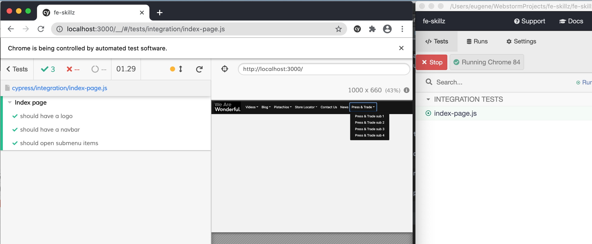

This project is using nextJS to server side render the navigation bar, leveraging SASS, TypeScript & reactJS.
The result is a fast loading, SEO friendly page, though it is not the fanciest most stylish Bootstrap NavBar out there, it is a good starting point for a project with SSR and Integration Testing via Cypress.

Also, please see Lighthouse report: 

To start the project in dev mode: npm run dev

To start in production mode, do npm run start 

The project uses TypeScript w/ React, it uses Cypress to test its functionality. 

The navigation data resides in /data/ folder and its rendered via Bootstrap React components.  

I use SASS processor and override variables in bootstrap theme. 
The idea is to style bootstrap components by overriding existing theme variables or add new variables, but avoiding adding adhoc hexcodes into css rules.

There are Cypress tests to check validity of integration of navigation's data with the UI, the links lead nowhere.

To run cypress do npm run cypress:open and it will launch cypress suite selection screen. 

To just do a cypress run headless, use npm run test. 

