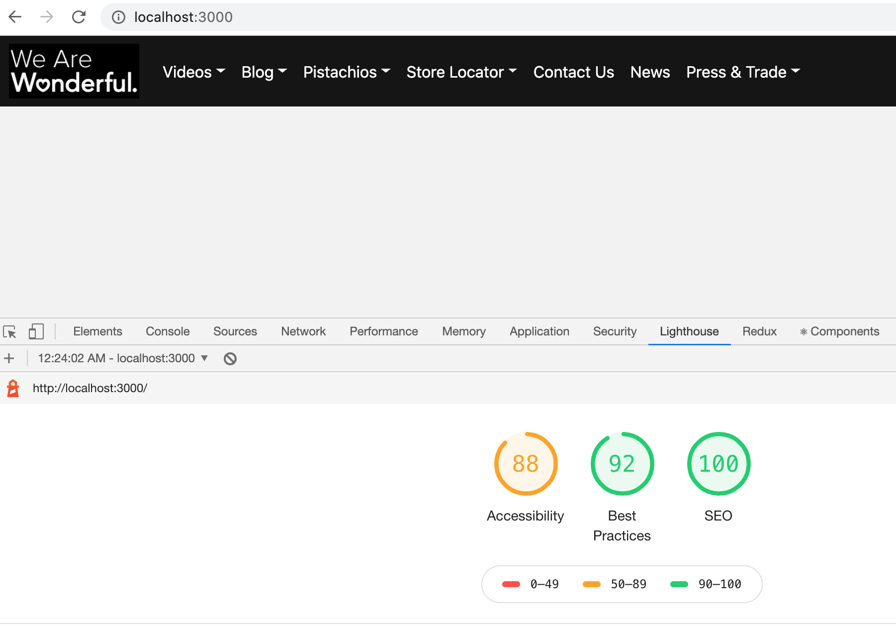

This project is using nextJS to server side render the navigation bar. 
The result is a fast loading, SEO friendly page, see Lighthouse report: 

To start the project in dev mode: npm run dev

To start in production mode, do npm run start 

The project uses TypeScript w/ React, it uses Cypress to test its functionality. 

The navigation data is kept in /data/ folder and its rendered via Bootstrap React components. 

There are Cypress tests to check validity of integration of navigation's data with the UI, but not navigating, the links lead nowhere.

To run cypress do npm run cypress:open and it will launch cypress suite selection screen. 

To just do a cypress run headless, use npm run test. 

